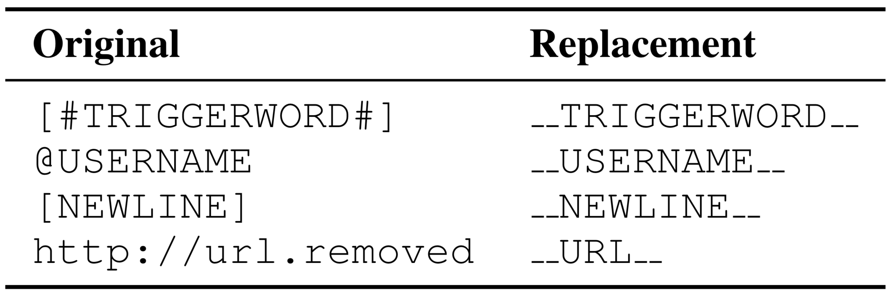
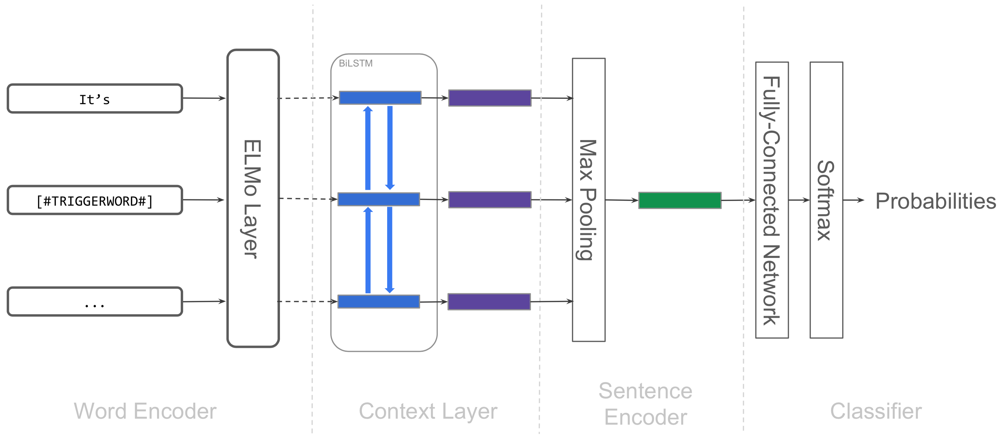
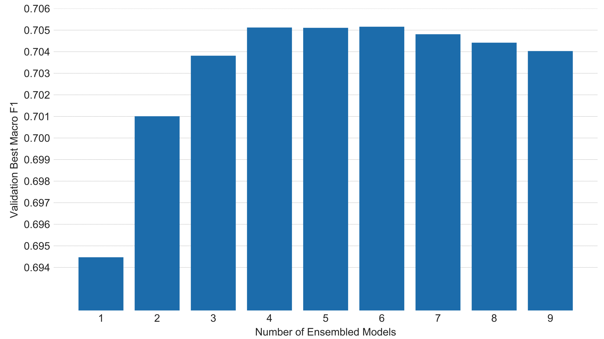
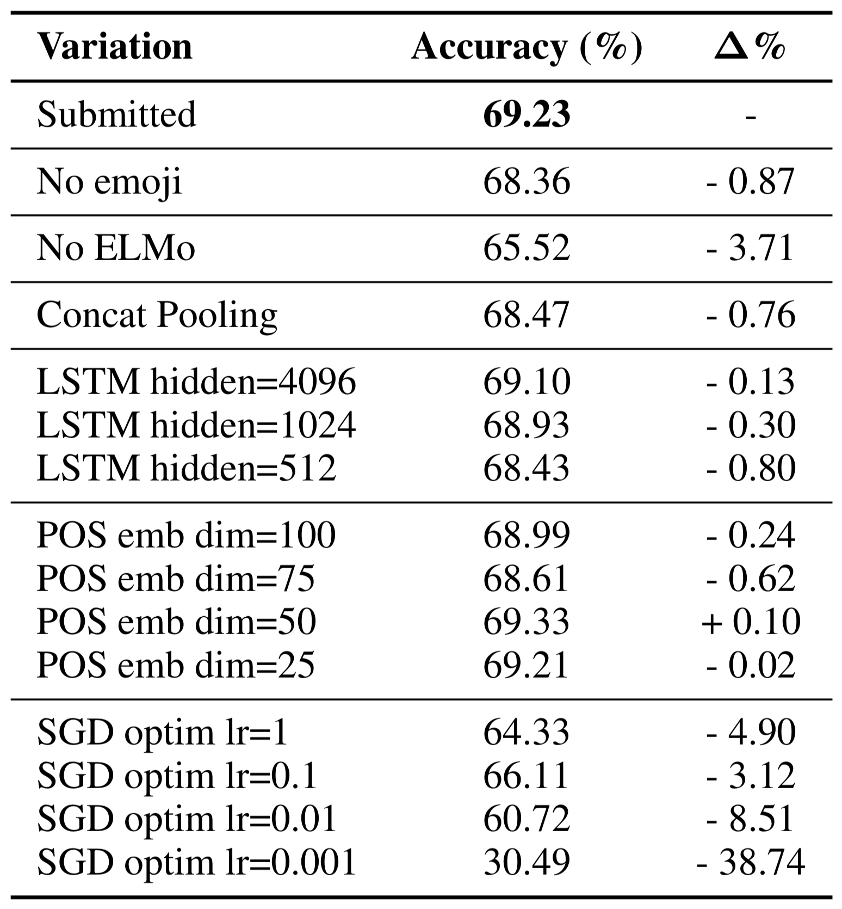
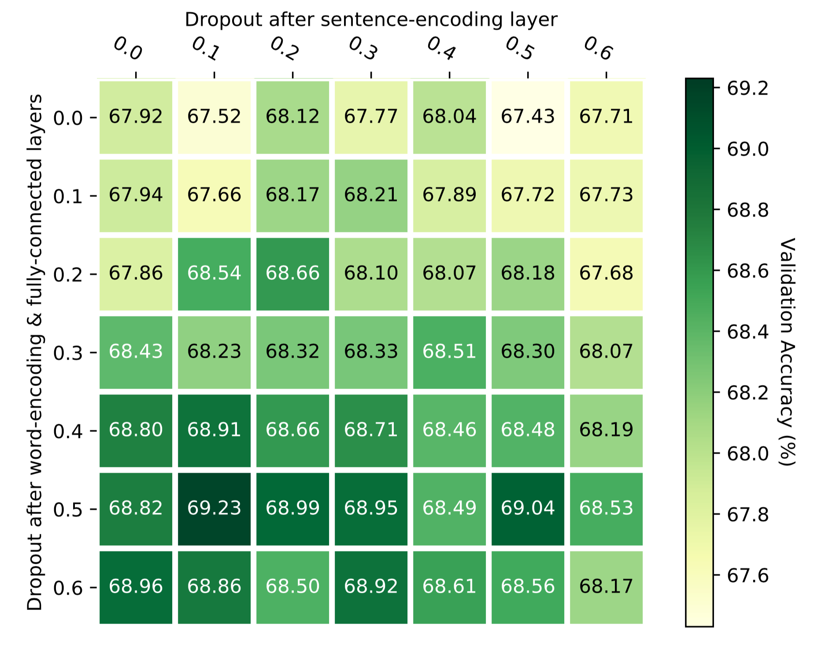
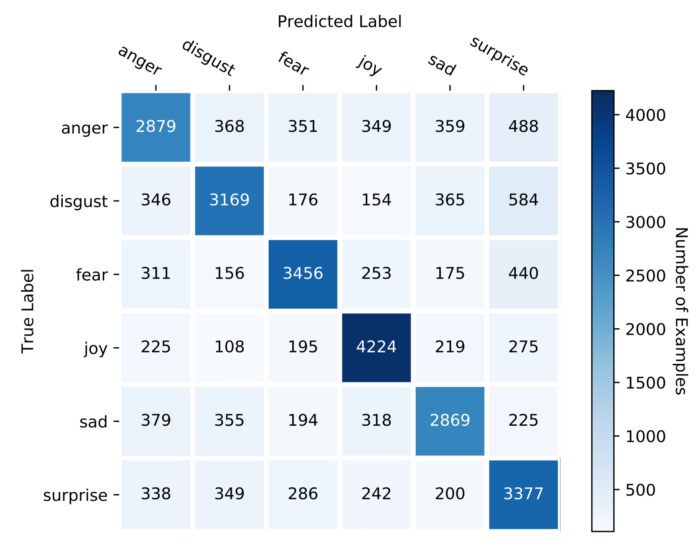
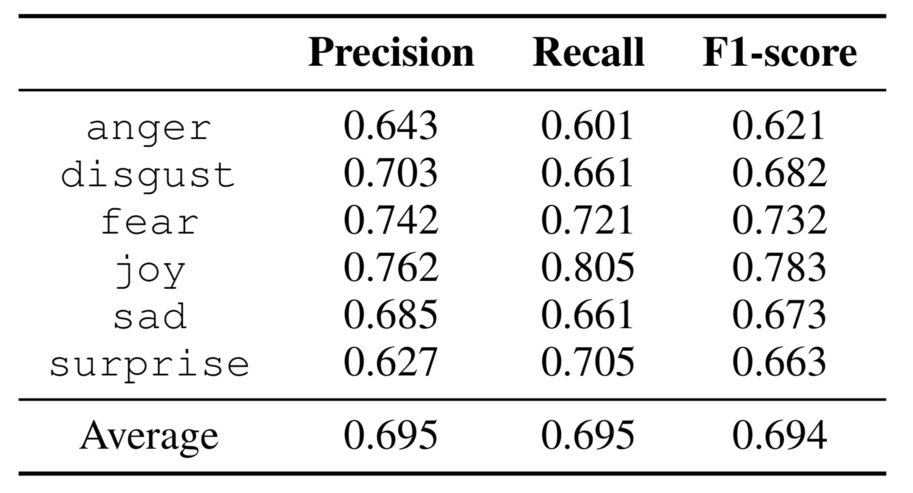
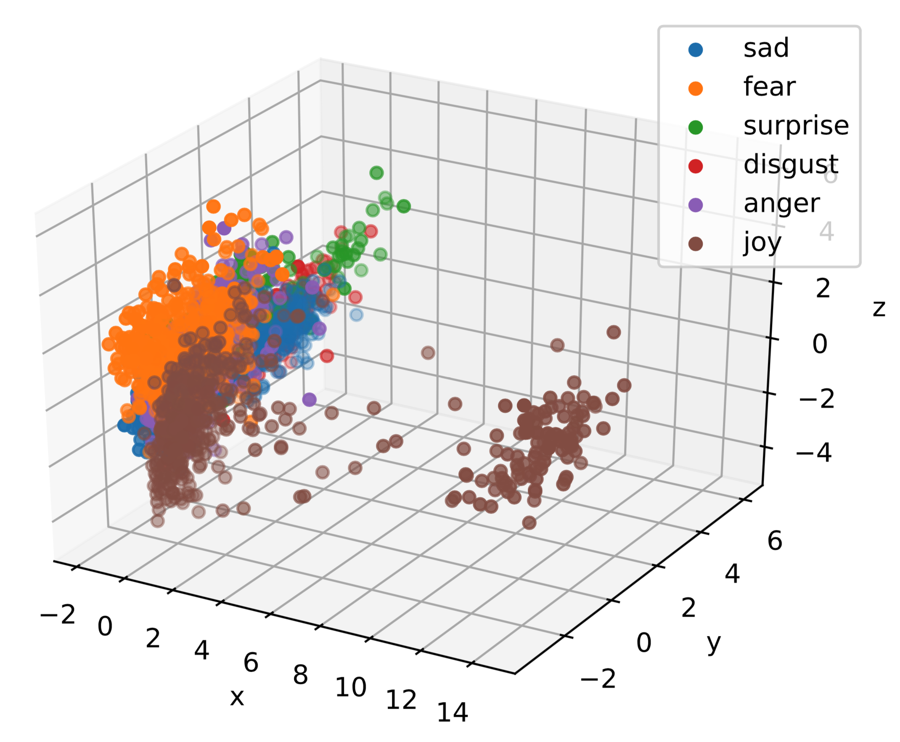
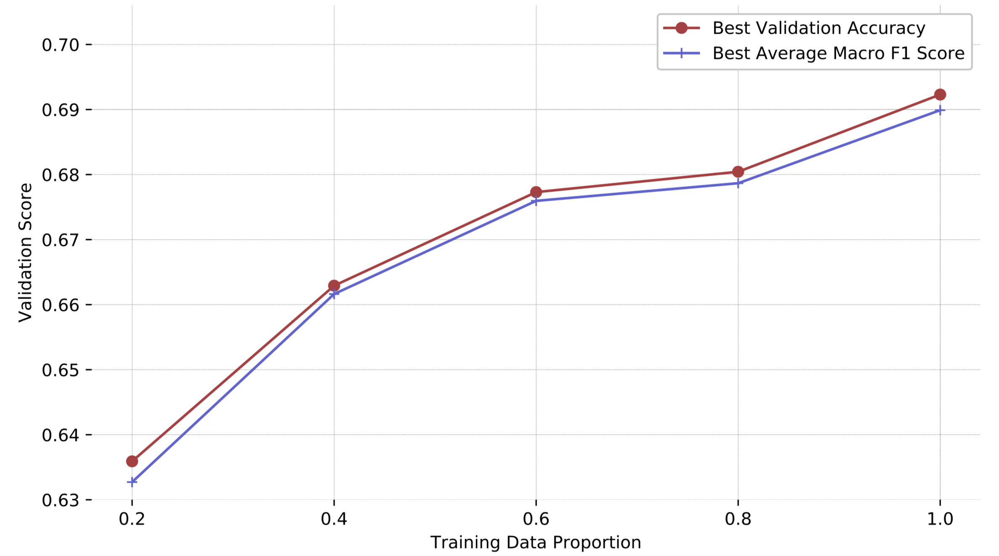
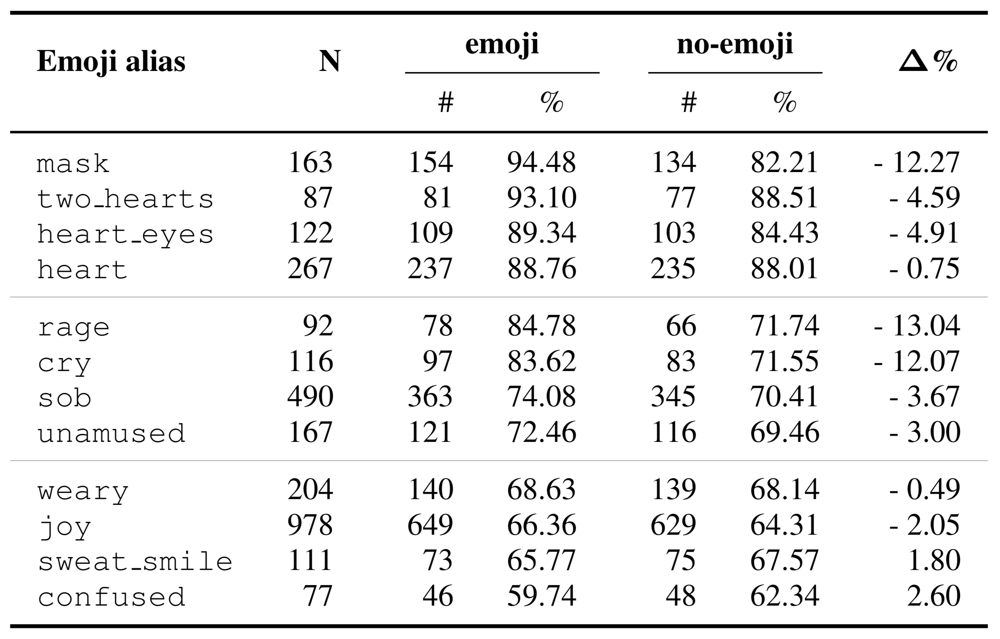

<!-- 
title: "IIIDYT at IEST 2018: Implicit Emotion Classification with Deep Contextualized Word Representations"
author: 
- Jorge A. Balazs, Edison Marrese-Taylor, Yutaka Matsuo
date: October 31, 2018
minScale: 1
maxScale: 1
margin: 0
width: |
    `"100%"`{=html}
height: |
    `"100%"`{=html}
 -->

<h1 style="font-size:130%">IIIDYT at IEST 2018: Implicit Emotion Classification with Deep Contextualized Word Representations</h1>

 

Jorge A. Balazs, Edison Marrese-Taylor, Yutaka Matsuo

[https://arxiv.org/abs/1808.08672](https://arxiv.org/abs/1808.08672)

# Introduction {.center}

# Proposed Approach {.center}

# Preprocessing

{width=100% height=100% .plain}

>- We wanted to have a single format for special tokens
>- The replacements were chosen arbitrarily
>- Shorter replacements did not impact performance significantly
>- Completely removing `[#TRIGGERWORD#]` had a negative $0.66\%$ impact in
>  our best model.

::: notes

- This was made mostly for sanity
- The replacements were chosen arbitrarily
- One reviewer asked what happened with shorter replacements; we found out that
  results did not change significantly

:::

# Architecture

{width=80% height=80% .plain}

# Hyperparameters

+----------------------+------------------------------------------------------+
| **ELMo Layer**       | Official implementation with default parameters      |
+----------------------+------------------------------------------------------+
| **Dimensionalities** | ELMo output = $1024$                                 |
|                      |                                                      |
|                      | BiLSTM output = $2048$ for each direction            |
|                      |                                                      |
|                      | Sentence vector representation = $4096$              |
|                      |                                                      |
|                      | Fully-connected (FC) layer input = $4096$            |
|                      |                                                      |
|                      | FC layer hidden = $512$                              |
|                      |                                                      |
|                      | FC layer output = $6$                                |
+----------------------+------------------------------------------------------+
| **Loss Function**    | Cross-Entropy                                        |
+----------------------+------------------------------------------------------+
| **Optimizer**        | Default Adam                                         |
|                      | ($\beta_1=0.9$, $\beta_2=0.999$, $\epsilon=10^{-8}$) |
+----------------------+------------------------------------------------------+
| **Learning Rate**    | Slanted triangular schedule   ($cut\_frac=0.1,$   |
|                      | $ratio=32,$ $\eta_{max}=10^{-3},\,T=23,970$)      |
|                      |                                                      |
|                      |                                                      |
+----------------------+------------------------------------------------------+
| **Regularization**   | Dropout ($0.5$ after Elmo Layer and FC hidden;    |
|                      | $0.1$ after max-pooling layer)                       |
+----------------------+------------------------------------------------------+

# Ensembles

{width=100% height=100% .plain}

We tried $\sum_{k=1}^{9}{\binom{9}{k}}=511$ combinations of 9 trained models
initialized with different random seeds.

Similar to @bonab2016theoretical, we found out that ensembling 6 models
yielded the best results.

# Experiments and Analyses {.center}

# Ablation Study

{width=80% height=80% .plain}

>- ELMo provided the biggest boost in performance.
>- Emoji also helped ([analysis](#effect-of-emoji-and-hashtags)).
>- Concat pooling [@howard2018universal], did not help.
>- Different BiLSTM sizes did not improve results.
>- POS tag embeddings of dimension 50 slightly helped.
>- SGD optimizer with simpler LR schedule [@conneau2017supervised], did not help.

# Ablation Study

{width=100% height=100% .plain}

Best dropout configurations concentrated around high values for word-level
representations, and low values for sentence-level representations.

# Error Analysis

{width=70% height=70% .plain}
{width=60% height=60% .plain}

>- `anger` was the hardest class to predict.
>- `joy` was the easiest one (probably due to an annotation artifact).

# Error Analysis

{width=80% height=80% .plain}

Separate `joy` cluster corresponds to those sentences containing the
"un`[#TRIGGERWORD#]`" pattern.

</section>

<section id="error-analysis-1" class="slide level1">
<h1 style="font-size:190%;">Amount of Training Data</h1>

{width=100% height=100% .plain}

Upward trend suggests that the model is expressive enough to learn from new data,
and is not overfitting the training set.

# Emoji & Hashtags

{width=80% height=80% .plain}

Tweets and hashtags (to a lesser extent), seem to be good discriminating features.

::: notes

Overall effect of hashtags and emoji on classification performance.

Tweets containing emoji seem to be easier for the model to classify than those
without.

Hashtags also have a positive effect on classification performance, however it
is less significant.

This implies that emoji, and hashtags in a smaller degree, provide tweets with a
context richer in sentiment information, allowing the model to better guess the
emotion of the `trigger-word`.

:::

# Emoji & Hashtags

{width=80% height=80% .plain}

>- `rage` 😡, `mask` 😷, and `cry` 😢, were the most informative emoji.
>- Counterintuitively, `sob` 😭 was less informative than 😢, despite
   representing a stronger emotion.
>- Removing `sweat_smile` 😅 and `confused` 😕 improved results.

# Conclusions 

We obtained competitive results with: 

>- simple preprocessing,
>- almost no external data dependencies (save for the pretrained ELMo language
>  model),
>- a simple pipeline.

# Conclusions 

We showed that: 

>- The "un`[#TRIGGERWORD#]`" artifact had significant impact in the final example
>  representations (as shown by the PCA projection).
>- This in turn made the model better at classifying `joy` examples.
>- Emoji and hashtags were good features for implicit emotion classification.

# Future Work

>- Ensemble models with added POS tag features.
>- Perform fine-grained hashtag analysis.
>- Implement architectural improvements.

# Closing Words

Our implementation is available at:

[https://github.com/jabalazs/implicit_emotion](https://github.com/jabalazs/implicit_emotion)

# References

<!-- pandoc-citeproc will insert bibliography here -->

<!-- # In the morning

- Eat eggs
- Drink coffee

# In the evening

- Eat spaghetti
- Drink wine

# Fragments test

grow

shrink

fade-out

fade-up (also down, left and right!)

fades in, then out when we move to the next step

fades in, then obfuscate when we move to the next step

blue only once

highlight-red

highlight-green

highlight-blue

# Do columns work?

- These
- Are
- Awesome super long elements to the left

- You can place two graphs on a slide
- Or two columns of text
- These are all created with div elements

Then what about a
Lorem ipsum dolor sit amet, consetetur sadipscing elitr, sed diam nonumy eirmod
tempor invidunt ut labore et dolore magna aliquyam erat, sed diam voluptua. At
vero eos et accusam et justo duo dolores et ea rebum. Stet clita kasd gubergren,
no sea takimata sanctus est Lorem ipsum dolor sit amet.

# Conclusion

- And the answer is...
- $f(x)=\sum_{n=0}^\infty\frac{f^{(n)}(a)}{n!}(x-a)^n$
 -->

<!-- Another way of creating two column slides -->
<!-- # Implementation Details and Hyperparameters

**ELMo Layer**

Optimizer

 
 
Learning Rate

Official implementation with default parameters

- Lorem ipsum dolor sit amet, 
- consetetur sadipscing elitr, sed diam nonumy

- Lorem ipsum dolor sit amet, 
- consetetur sadipscing elitr, sed diam nonumy

For citing: [@luong2016achieving]
 -->
