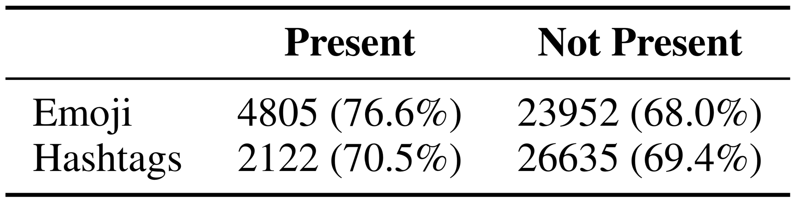

# Introduction {.center}

# Proposed Approach {.center}

# Preprocessing

{width=80% height=80% .plain}

::: notes

- This was made mostly for sanity
- The replacements were chosen arbitrarily
- One reviewer asked what happened with shorter replacements; we found out that
  results did not change significantly

:::

# Architecture

{width=80% height=80% .plain}

# Implementation Details and Hyperparameters

+----------------------+-------------------------------------------------+
| **ELMo Layer**       | Official implementation with default parameters |
+----------------------+-------------------------------------------------+
| **Dimensionalities** | ELMo output = $1024$                            |
|                      |                                                 |
|                      | BiLSTM output = $2048$ for each direction       |
|                      |                                                 |
|                      | Sentence vector representation = $4096$         |
|                      |                                                 |
|                      | Fully-connected (FC) layer input = $4096$        |
|                      |                                                 |
|                      | FC layer hidden = $512$                         |
|                      |                                                 |
|                      | FC layer output = $6$                           |
+----------------------+-------------------------------------------------+

# Implementation Details and Hyperparameters

+--------------------+------------------------------------------------------+
| **Loss Function**  | Cross-Entropy                                        |
+--------------------+------------------------------------------------------+
| **Optimizer**      | Default Adam                                         |
|                    | ($\beta_1=0.9$, $\beta_2=0.999$, $\epsilon=10^{-8}$) |
+--------------------+------------------------------------------------------+
| **Learning Rate**  | Slanted triangular schedule ($cut\_frac=0.1,$     |
|                    | $ratio=32,\,\eta_{max}=10^{-3},\,T=23,970$)          |
|                    |                                                      |
|                    |                                                      |
+--------------------+------------------------------------------------------+
| **Regularization** | Dropout ($0.5$ after Elmo Layer and FC hidden;    |
|                    | $0.1$ after max-pooling layer)                       |
+--------------------+------------------------------------------------------+

# Ensembles

{width=100% height=100% .plain}

We tried $\sum_{k=1}^{9}{\binom{9}{k}}=511$ combinations of 9 trained models
initialized with different random seeds.

Similar to @bonab2016theoretical, we found out that ensembling 6 models
yielded the best results.

# Experiments and Analyses {.center}

# Ablation Study

{width=80% height=80% .plain}

>- ELMo provided the biggest boost in performance.
>- Emoji also helped ([analysis](#effect-of-emoji-and-hashtags)).
>- Concat pooling [@howard2018universal], did not help.
>- Different BiLSTM sizes did not improve results.
>- POS tag Embeddings of dimension 50 slightly helped.
>- SGD optimizer with simpler LR schedule [@conneau2017supervised], did not help.

<!-- # Ablation Study

{width=80% height=80% .plain}

Dropout concentrated around high values for word-level
representations and low values for sentence-level representations yielded better
results.

 -->

# Ablation Study

{width=100% height=100% .plain}

Dropout concentrated around high values for word-level
representations and low values for sentence-level representations yielded better
results.

<!-- # Error Analysis

{width=50% height=50% .plain}
 -->
# Error Analysis

:::::: columns

{width=70% height=70% .plain}
{width=50% height=50% .plain}

>- `anger` was the hardest class to predict
>- `joy` was the easiest one 
   
(probably due to an annotation artifact)

::::::

# Error Analysis

{width=80% height=80% .plain}

Separate `joy` cluster corresponds to those sentences containing the
"un`[#TRIGGERWORD#]`" pattern.

# Effect of the Amount of Training Data

{width=60% height=60% .plain}

# Effect of Emoji and Hashtags

{width=80% height=80% .plain}

Number of examples with and without emoji and hashtags. Numbers between
parentheses correspond to the percentage of examples classified correctly.

Tweets and hashtags, to a lesser extent, seem to improve performance.

::: notes

Overall effect of hashtags and emoji on classification performance.

Tweets containing emoji seem to be easier for the model to classify than those
without.

Hashtags also have a positive effect on classification performance, however it
is less significant.

This implies that emoji, and hashtags in a smaller degree, provide tweets with a
context richer in sentiment information, allowing the model to better guess the
emotion of the `trigger-word`.

:::

# Effect of Emoji and Hashtags

{width=80% height=80% .plain}

>- `rage` 😡, `mask` 😷, and `cry` 😢, were the most informative emoji.
>- Counterintuitively, `sob` 😭 was less informative than 😢 despite
   representing a stronger emotion.
>- Removing `sweat_smile` 😅 and `confused` 😕 improved results.

# Conclusions and Future Work {.center}

# References

<!-- pandoc-citeproc will insert bibliography here -->

<!-- # In the morning

- Eat eggs
- Drink coffee

# In the evening

- Eat spaghetti
- Drink wine

# Fragments test

grow

shrink

fade-out

fade-up (also down, left and right!)

fades in, then out when we move to the next step

fades in, then obfuscate when we move to the next step

blue only once

highlight-red

highlight-green

highlight-blue

# Do columns work?

- These
- Are
- Awesome super long elements to the left

- You can place two graphs on a slide
- Or two columns of text
- These are all created with div elements

Then what about a
Lorem ipsum dolor sit amet, consetetur sadipscing elitr, sed diam nonumy eirmod
tempor invidunt ut labore et dolore magna aliquyam erat, sed diam voluptua. At
vero eos et accusam et justo duo dolores et ea rebum. Stet clita kasd gubergren,
no sea takimata sanctus est Lorem ipsum dolor sit amet.

# Conclusion

- And the answer is...
- $f(x)=\sum_{n=0}^\infty\frac{f^{(n)}(a)}{n!}(x-a)^n$
 -->

<!-- Another way of creating two column slides -->
<!-- # Implementation Details and Hyperparameters

**ELMo Layer**

Optimizer

 
 
Learning Rate

Official implementation with default parameters

- Lorem ipsum dolor sit amet, 
- consetetur sadipscing elitr, sed diam nonumy

- Lorem ipsum dolor sit amet, 
- consetetur sadipscing elitr, sed diam nonumy

For citing: [@luong2016achieving]
 -->
